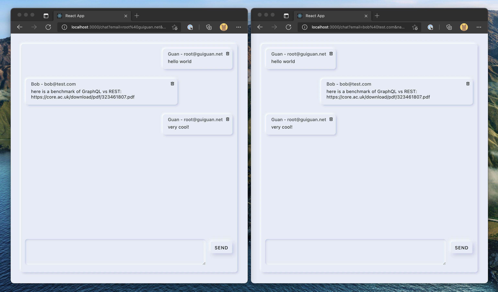
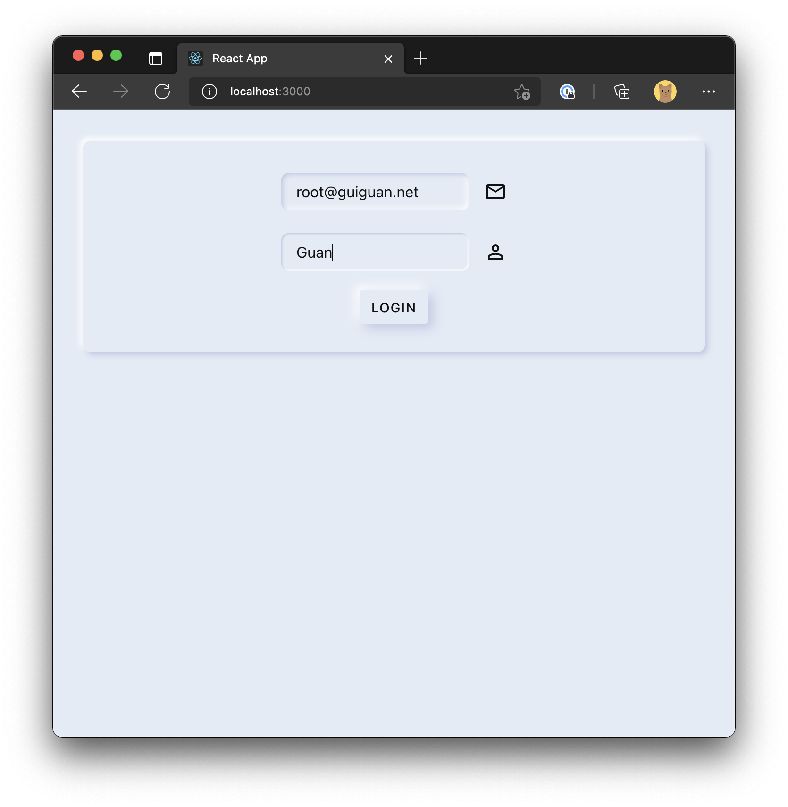
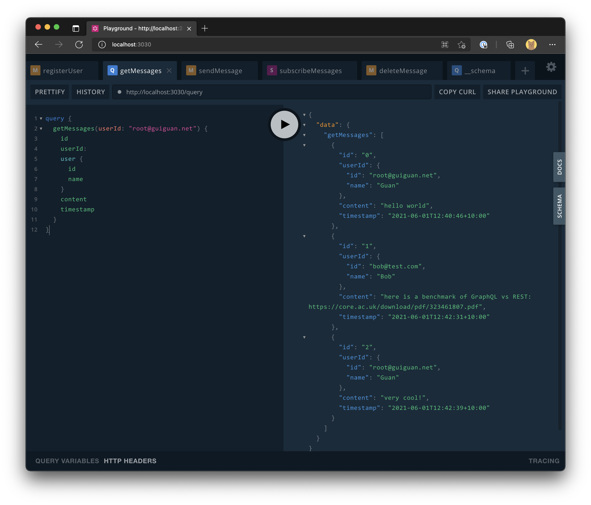

# GraphQL Chat

In this demo, I created a simple chat app with frontend built with React and backend built with Golang. The purpose of this demo is to show how easy and powerful it is for us to generate lots of boilerplate code from a GraphQL schema and a GraphQL operation document. With this automation level, we can focus more on actual business logic, write less code and finish work early.

## Usage

1. clone this repo
2. start backend: `cd backend && make`
3. start frontend:
   1. open a new terminal
   2. `cd frontend`
   3. `npm i`
   4. `npm start`

- frontend: http://localhost:3000
- gql playground: http://localhost:3030

## Screenshots

## References

- [GraphQL Code Generator](https://www.graphql-code-generator.com/)
- [gqlgen](https://gqlgen.com/)
- [The Fullstack Tutorial for GraphQL](https://www.howtographql.com/)
- [GraphQL Schema Basics](https://www.apollographql.com/docs/apollo-server/schema/schema/)
